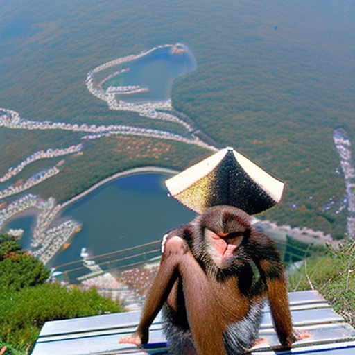
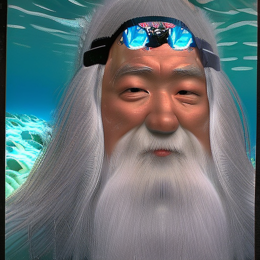
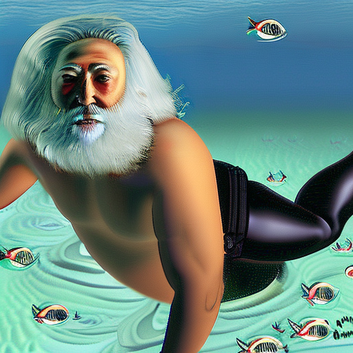

---

- Example 1
  - Prompt: 富士山頂にいるルフィ, ("MONKEY･D･LUFFY on the top of Mount Fuji.")

---

- Example 2
  - Prompt: ハワイでダイビングをしている白髪、長髪、ヒゲ長、和風仙人（ただし裸眼）(Highly realistic image of a white-haired, long-haired, long-bearded, Japanese-looking hermit who scuba dives in Hawaii, with the naked eye.")

---